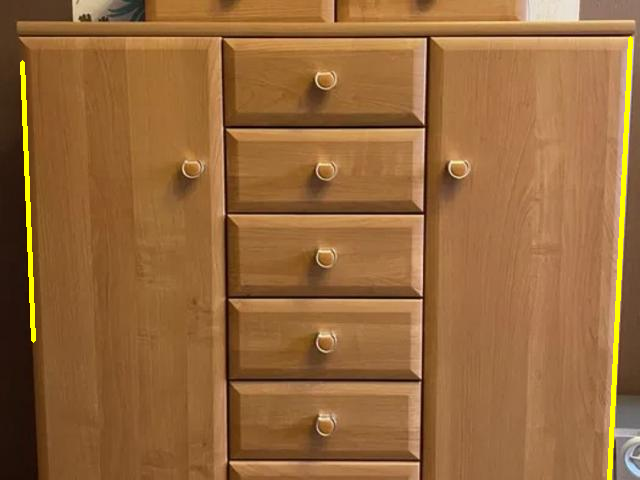
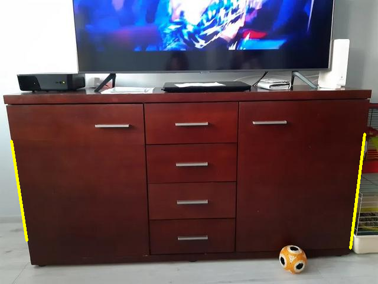
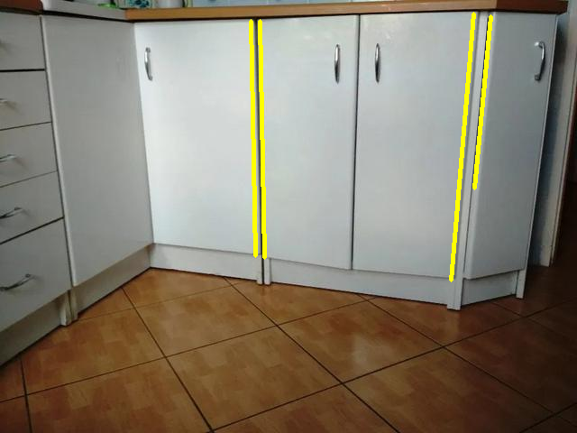
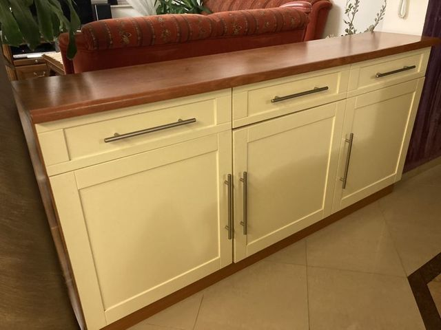
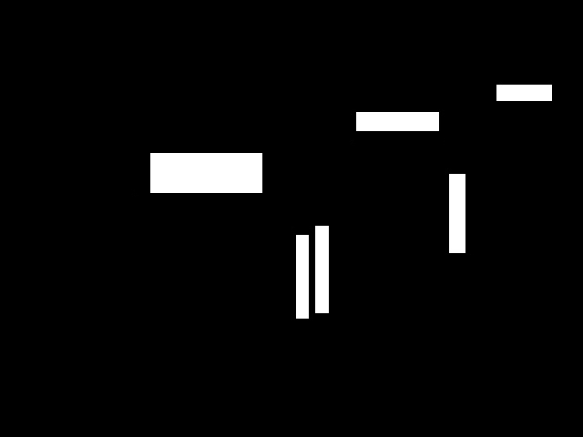
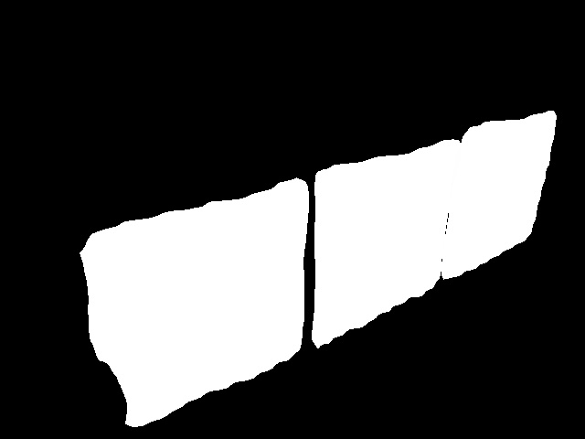

# ros_joint_detector
<p align="center">
  
&nbsp; &nbsp; &nbsp; &nbsp;
  
&nbsp; &nbsp; &nbsp; &nbsp;
  
</p>

The goal of the project is to build a ROS node that would be responsible for detecting rotational joints. The module uses a neural network to perform the task and utilizes U-Net architecture with EfficientNetB0 working as a backend. 
 
This module is part of my master thesis "Point cloud-based model of the scene enhanced with information about articulated
objects" and **requires** two other modules to work properly:
- [Handler detector](https://github.com/arekmula/ros_handler_detector)
- [Front detector](https://github.com/arekmula/ros_front_detection_segmentation)

The third module [Articulated objects scene builder](https://github.com/arekmula/articulated_objects_scene_builder) utilize results of the rest of the modules to find articulated objects in a 3D environment.

## How it works
<p align="center">
  
&nbsp; &nbsp; &nbsp; &nbsp;
  
&nbsp; &nbsp; &nbsp; &nbsp;
  
</p>

The module utilizes the results of the handler detection module as well as the front detection module to prepare input for the neural network. The input of the network has 5 channels:
- RGB image
- Handlers mask
- Rotational fronts mask

The prediction results are then post-processed to get rid of false positive predictions and to attach a rotational joint to a rotational object.

## Results
- Accuracy: **61.02 %**
- False positive rate: **3.54 %**


## Dependencies
- ROS Noetic
- Anaconda
- image-classifiers `pip install image-classifiers`
- efficientnet `pip install efficientnet`

## Installation
- Create conda environment from environment.yml file `conda env create -f environment.yml`
- Activate environment `conda activate ros_joint_seg`
- Create catkin workspace with Python executable set from conda:

```
source /opt/ros/noetic/setup.bash
mkdir -p caktin_ws/src
cd catkin_ws
catkin_make -DPYTHON_EXECUTABLE=~/anaconda3/envs/ros_joint_seg/bin/python3.8
```
- Clone the repository
```
source devel/setup.bash
cd src
git clone https://github.com/arekmula/ros_joint_segmentation
cd ~/catkin_ws
catkin_make
```

## Run with
From activated conda environment run following commands (**remember to source ROS base and devel environment**):
- Setup ROS parameters:
```
rosparam set rgb_image_topic "image/topic"
rosparam set joint_prediction_topic "topic/to/publish/prediction"
rosparam set visualize_joint_prediction True/False
rosparam set joint_seg_model "path/to/model/model.h5"
```

- Run with
```
rosrun ros_joint_segmentation joint_segmentation.py 
```